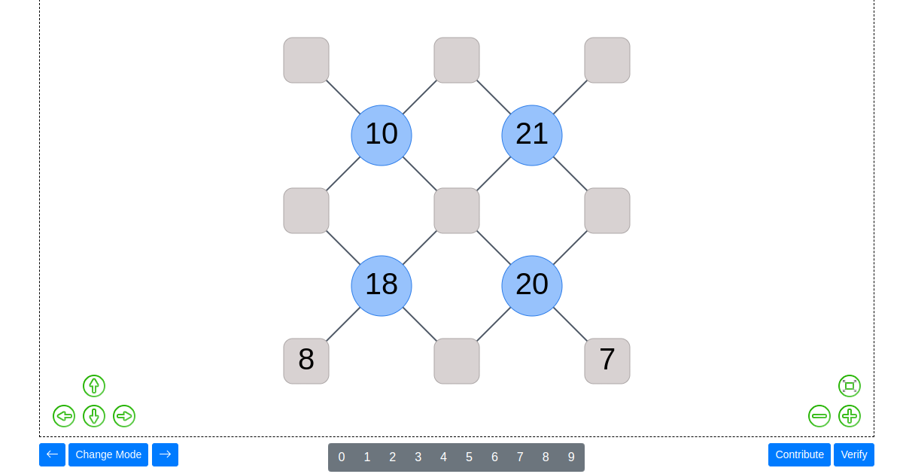

# zkSujiko



## Live demo
You can check out a live demo [here](https://zksujiko.netlify.app).

## Build Setup

```bash
# install dependencies
$ yarn install

# serve with hot reload at localhost:3000
$ yarn dev

```

## circuits

Circuits folder contains 2 .circom files (sujiko.circom and sujiko62.circom) and a folder (circomlibs) with the circuits they use as dependencies. These files are used to generate their respectives .wasm files (sujiko.wasm and sujiko62.wasm) and .zkey files (sujiko_0001.zkey and sujiko62_0001.zkey) also two solidity contracts (SujikoVerifier.sol and Sujiko62Verifier.sol).

### Both circuits validates the following conditions (for their corresponding type of sujiko)

* The submited solution comes from the provided sujiko.
* All the numbers of the squares are between 1 and n. (n is the number of squares of the sujiko)
* All the numbers of the squares are unique.
* All the numbers of the circles are equal to the sum of all the numbers in their adjacent squares.

## static

This folder contains the previously generated .wasm and .zkey files.

## contracts

Contracts folder contains 4 .sol files (Sujiko.sol, SujikoVerifier.sol, Sujiko62.sol and Sujiko62Verifier.sol)

## utils

Contains the file DeployedContracts.json, which contains the addresses of both solidity contracts Sujiko.sol and Sujiko62.sol in the Harmony Testnet. Also 2 ABI files for these contracts (Sujiko.json and Sujiko62.json).

## zkutils

Contains 3 .js files (sujiko_prover.js, sujiko62_prover.js and zkproof.js) these are the core of zk-proofs generation and validation process.

## Remaining folders and files

They are specifically related to Nuxt and the front-end of the application.
More information in [the documentation](https://nuxtjs.org/docs/2.x/directory-structure/).
